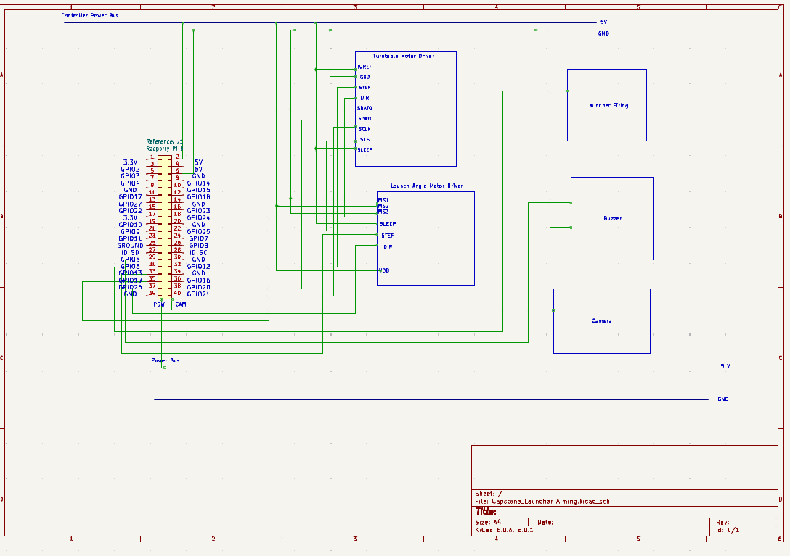

# Launcher Aiming Control Unit
## Functionality
The launch aiming control unit handles the different functions within the launcher. This includes controlling the signals for the motors for the launcher aiming subsystem, sending a signal for the buzzer to indicate that the launcher is about to fire, and sending a signal to the launcher firing subsystem indicating to fire.
## Constraints
C1: The launch aiming control unit shall have the sufficient amount of pins to control the each subsystem

C2: The launch aiming control unit shall have the ability to have network communication. This is to recieve data between the projectile path sensing and the velocity and acceleration sensing subsystems located on the sensor posts.

## Electrical Schematic

## Analysis
C1 Solution:

| Housing | Type of Pins | Number |
|-----------------|--------------|--------|
|| GPIO | 1 |
|| GND | 1 |

| Aiming Subsystem | Type of Pins | Number |
|-----------------|--------------|--------|
|| VCC | 1 |
|| GPIO | 5 |
|| SCK | 1 |
|| MOSI | 1 |
|| MISO | 1 |
|| GND | 1 |

| Launcher Firing | Type of Pins | Number |
|-----------------|--------------|--------|
|| GPIO | 1 |

| Head-On Sensing | Type of Pins | Number |
|-----------------|--------------|--------|
|| Camera Ribbon Cable | 1 |

| Raspberry Pi 5 | Type of Pins | Number |
|-----------------|--------------|--------|
|| Camera Ribbon Cable | 1 |
|| GPIO | 26|
|| VCC | 2 |
|| 3.3 V | 2 |
|| GND | 8|
|| ID EEPROM |2|
|| SCK | 2|
|| MOSI| 2|
|| MISO| 2|

As seen in the tables above, the raspberry pi 5 should have the sufficient pins for the to control each subsystem [1]

C2 Solution:

The Raspberry Pi 5 can communicate wirelessly with the sensor post controllers using UDP packets. This is shown in a tutorial by AranaCorp [2]. 

## Launcher Aiming Control 
### Process Diagram

### Process Description
The launcher aiming system recieves inputs from the projectile path sensing system and the head-on sensing system to locate what fishing line the target is traveling on and at what height. Once the controller has determined the path and height, it sends signals to the stepper motor drivers to adjust the position of the launcher. The launcher aiming system is controlled by sending pulses to the STEP pin of the drivers and sending a signal to the DIR pin to indicate direction. It is important to note that the vendor of the stepper motor drivers explicitly states that the motor position can be controlled precisely without a feedback system in place [3]. Since each step signal corresponds to a degree step to the stepper motors for the launcher aiming system, the posistion of the launcher in reference to  the starting position can be determined based on the number of step pulses sent to the driver.

$$ \theta_{aim} = n_{steps}*\theta_{step} $$

To calculate the time to fire, the launcher aiming takes inputs from the projectile velocity and accelartion sensing and finds the time to fire in the equations below:

$$ x_{travel} = x_{target} - x_{intercept} $$

$$ t_{intercept} = \frac{-v_{target} + \sqrt{v_{target}^2-4a_{target}x_{travel}}}{2a_{target}} $$

$$ t_{fire} = t_{intercept } - t_{aim} - t_{process} - t_{sensordelay}-t_{launch}-t_{launchtravel} $$

Once the time to fire is up, it sends a signal to the buzzer to indicate it is about to fire and sends the signal is sent to the launcher firing mechanism to fire a projectile.

Once a projectile is fired, the launcher aiming motors move back to the starting reference point. To get back to the starting reference point, simply set the same sumber of pulses to the STEP pin and invert the DIR signal. 

## References
[1] https://www.raspberrypi.com/documentation/computers/raspberry-pi.html#gpio-and-the-40-pin-header

[2] https://www.aranacorp.com/en/udp-communication-between-raspberry-pi-and-esp32/

[3] https://www.pololu.com/category/120/stepper-motor-drivers 
